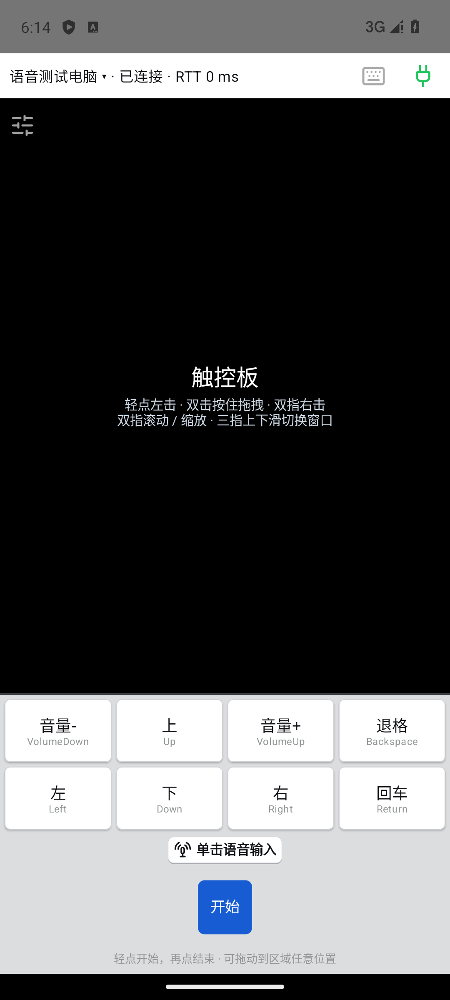
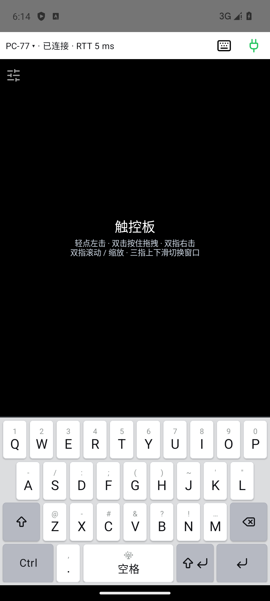

# TapDeck

通过 Wi-Fi 局域网，把 Android 手机变成 Windows 电脑的麦克风、触控板和键盘，方便 Vibe Coding 和日常操作。

**[Windows EXE](https://github.com/fly3457/TapDeck/releases/download/v0.3.18/TapDeck-0.3.18.exe) · [Android APK](https://github.com/fly3457/TapDeck/releases/download/v0.3.18/TapDeck-0.3.18.apk) · [完整下载与校验](https://github.com/fly3457/TapDeck/releases/tag/v0.3.18)**

当前测试版 **0.3.18** · Android **code 21** · Windows 11 x64 · Android 8 及以上 · 同一局域网

## 功能特色

- 手机麦克风传音到 PC，配合输入法或支持语音输入的 Agent 软件转成文字。
- 触控板支持点击、拖拽、双指滚动与缩放、三指窗口操作。
- 可切换全键盘，输入字母、数字、符号和组合键。
- 最多八个自定义快捷键、三组语音配置，支持长按和单击起停。
- 一部手机可配对多台 PC 并切换控制；一台 PC 最多连接五个控制端。
- 每部手机独立设置灵敏度、震动和控件位置。
- 配对与控制使用加密局域网连接。

## 首次使用

1. 在 PC 运行 EXE，在手机安装 APK。PC“连接”页也能扫码下载内置 APK。
2. 手机扫码填写 PC 连接网址，点击“连接”；在 PC 核对校验码并允许。
3. 首次运行时会检测虚拟键盘和虚拟声卡，缺失时提示安装。虚拟键盘用于触发豆包等输入法的语音热键，虚拟声卡用于将手机音频接入电脑麦克风。只用触控板和普通键盘可不安装。
4. 系统、输入法或 Agent 的麦克风选 **CABLE Output**。语音热键与目标软件设置一致，留空则只传音。保存配置并让目标输入框获得焦点，再从手机开始语音。

推荐配合[豆包输入法 Windows 版](https://ime.doubao.com/pc)使用。TapDeck 负责传音和触发热键，语音识别由输入法或 Agent 软件完成。详细步骤见[安装与配对](docs/installation.md)。

## 界面

  
  

界面示例使用测试配置；实机验收范围见[验证记录](docs/verification.md)。

## 致谢

- 感谢 [Ryochan7 / FakerInput](https://github.com/Ryochan7/FakerInput) 提供虚拟键盘。首次使用豆包等输入法的语音热键时需要它，让输入法顺利接收按键；不需要这类功能可不安装。
- 感谢 [VB-Audio / VB-CABLE](https://vb-audio.com/Cable/) 提供虚拟声卡，将手机传来的音频交给 PC 麦克风输入；不需要手机传音可不安装。VB-CABLE 是 donationware，可在官网捐赠或购买许可。

TapDeck 采用 [MIT 许可证](LICENSE)，第三方组件适用各自许可，详见[第三方声明](THIRD_PARTY_NOTICES.md)。

## 文档与开发

[使用与开发文档](docs/README.md) · [控制协议](protocol/README.md) · [版本与发布规则](docs/versioning.md)

从仓库根目录构建：`powershell -File scripts/build-windows.ps1`。该流程构建并测试 Android、内嵌最新 APK，再构建和核验 Windows 产物。
