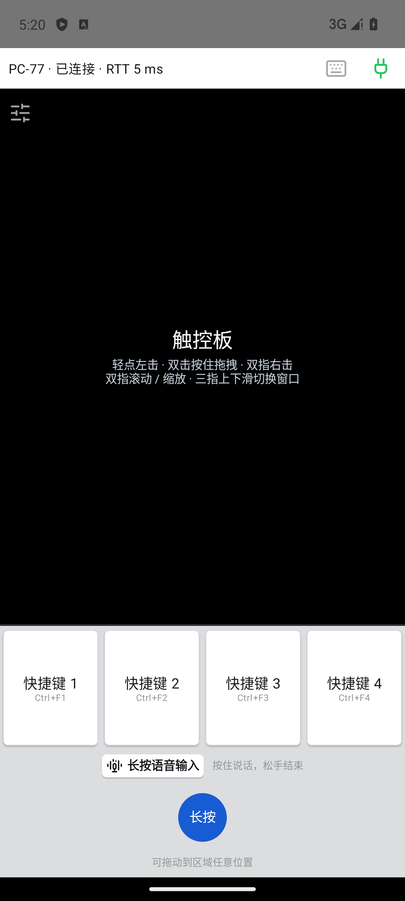

# TapDeck

**面向 Vibe Coding 的手机语音与触控控制台。**

把 Android 手机放在电脑旁，用语音向 AI 编程工具描述需求，用快捷键提交、复制、粘贴和撤销，再用触控板与键盘查看结果、补充细节。电脑显示编辑器、AI 对话和运行预览，手机集中提供输入与操作，让长段提示词和反复迭代更顺手。

TapDeck 将手机麦克风的声音传到 Windows，配合电脑上的语音输入法把话语转换成当前输入框中的文字。语音识别由你选择的输入法完成，TapDeck 负责传音、触发热键和控制键鼠。

**[下载 Windows EXE](https://github.com/fly3457/TapDeck/releases/download/v0.3.6/TapDeck.exe) · [下载 Android APK](https://github.com/fly3457/TapDeck/releases/download/v0.3.6/TapDeck-debug.apk) · [查看完整发布包](https://github.com/fly3457/TapDeck/releases/tag/v0.3.6)**

## 为 Vibe Coding 准备的功能

| 功能 | 在 AI 编程中的用途 |
|---|---|
| 手机语音输入 | 用已有手机的麦克风描述需求、复述报错、补充上下文。支持按住说话、松手结束，也支持轻点开始、再点结束的连续输入 |
| 1–8 个可配置快捷键 | 把复制、粘贴、撤销、回车等常用操作放在手机上；按 AI 工具的使用习惯设置名称与组合键 |
| 触控板与全键盘 | 移动、点击、拖拽、滚动、缩放和切换窗口；需要时切到全键盘补英文、数字和符号，长按空格直接说话 |
| 每台手机独立调节 | 触控板灵敏度为 0.5×–3.0×，默认 1.0×；按键震动、语音模式和控件位置保存在当前 Android 设备上 |
| 配对后自动重连 | 首次由 PC 核对校验码并允许，之后重开 App 或接收端自动重连；支持电脑登录后在托盘后台启动 |
| 单 EXE 交付 | Windows 程序内嵌对应版本的 APK、虚拟键盘与虚拟声卡安装包；手机扫码即可打开安装与配对网页 |

## 一轮 Vibe Coding 怎么用

1. 在电脑上选中 AI 编程工具的输入框。
2. 用手机说出需求，例如：“把登录按钮加大，提交时显示加载状态，失败时保留输入内容。”
3. 语音输入法生成文字后，用手机快捷键按工具习惯确认、换行或撤销；切换全键盘补上数字、符号或英文。
4. 用触控板切到编辑器、文档或运行预览，查看结果，再继续说出下一轮修改。

默认启用复制、粘贴、撤销和回车四个快捷键。可在 PC“快捷键”页调整为你实际使用的操作，再点“保存并同步配置”。

## 界面预览

快捷键＋语音模式与全键盘模式共用底部区域，切换时触控板边界保持一致。

<p>
  
  
</p>

以上为 0.3.6 模拟器截图，快捷键名称及组合键使用演示配置。

## 下载与安装

当前版本为 **0.3.6（测试版）**，Android `versionCode=9`。支持 **Windows 11 x64**、**Android 8 / API 26 及以上**；手机与电脑需要处于可互通的局域网。

| 文件 | 用途 |
|---|---|
| [TapDeck.exe](https://github.com/fly3457/TapDeck/releases/download/v0.3.6/TapDeck.exe) | Windows 接收端，已内嵌新版 APK 和驱动原包，可独立运行 |
| [TapDeck-debug.apk](https://github.com/fly3457/TapDeck/releases/download/v0.3.6/TapDeck-debug.apk) | Android App，保留现有包名和签名，可覆盖安装 |
| [TapDeck-0.3.6.zip](https://github.com/fly3457/TapDeck/releases/download/v0.3.6/TapDeck-0.3.6.zip) | 完整交付包，含 EXE、APK、诊断工具、说明、许可证与验证截图 |
| [SHA256SUMS.txt](https://github.com/fly3457/TapDeck/releases/download/v0.3.6/SHA256SUMS.txt) | 文件与完整 ZIP 的 SHA-256 校验值 |

首次使用：

1. **启动电脑端。** 下载并运行 `TapDeck.exe`，允许访问本地网络。窗口关闭后程序留在托盘，从托盘选择“退出”才停止接收；升级时先退出旧版本。
2. **安装手机端。** 用手机系统扫码工具扫描 PC“连接”页的“扫码安装 Android 端”二维码，打开网页下载 APK；也可使用上面的直接下载链接。已安装用户在网页点“打开 TapDeck 连接”，或在 App 中输入 PC 显示的网址。
3. **完成配对。** 在 PC 核对手机上的校验码，点“校验码一致，允许”。配对成功后保存凭据，下次自动重连。
4. **配置语音链路。** PC“语音”页可安装 VB-CABLE 并重新检测；按官方要求安装后重启。TapDeck 输出选择 **CABLE Input**，电脑语音输入法的麦克风选择 **CABLE Output**。
5. **设置语音热键。** 根据输入法的实际设置填写长按、免按开始和免按结束热键；首次使用手机麦克风时允许录音权限。
6. **安排常用快捷键。** PC“快捷键”页启用 1–8 项并保存同步，就可以开始操作。

## 语音联动设置

音频路径为：**手机麦克风 → 局域网传音 → CABLE Input / Output → PC 语音输入法 → 当前输入框**。

- 手机语音区顶部切换两种模式：圆形控件按住说话、松手结束；方形控件轻点开始、再点结束。录音控件可拖动，位置会保存；全键盘长按空格也可启动语音。单击模式录音中按快捷键会先结束录音，结束后再按快捷键执行后续操作。
- PC 分别配置“长按热键”“免按开始热键”“免按结束热键”。默认留空时仅传音；要联动输入法，需要填写与该输入法一致的热键，并让目标输入框获得焦点。
- 左右修饰键分别识别。例如输入法设置为右 Ctrl＋M，应填写 `RightCtrl+M`；`Ctrl+M` 表示左 Ctrl＋M。可使用“录入”或“单键选择”填写。
- Windows EXE 内嵌 FakerInput 虚拟键盘安装包。需要虚拟键盘的输入法可从 PC“快捷键”页点“安装 / 修复虚拟键盘”，键盘发送方式默认使用“自动”。
- VB-CABLE 安装需管理员授权并重启 Windows。TapDeck 提供安装与检测入口，麦克风选择按上面的 CABLE 路由设置，程序不自动更改 Windows 默认麦克风。

豆包输入法的热键配置与历史实测见 [语音热键说明](docs/voice-hotkey.md)，驱动与安装细节见 [安装引导](docs/installation.md) 和 [虚拟键盘说明](docs/virtual-keyboard.md)。

## 常用操作

| 手机操作 | 电脑效果 |
|---|---|
| 单指移动、轻点 | 移动鼠标、左击；首次轻点等待约 300 ms 判定 |
| 双击后第二次按住 | 持有左键，可拖拽；快速松手才形成双击 |
| 双指轻点、滑动 | 右击、滚动；自然滚动方向可在 PC 设置 |
| 双指张开、合拢 | 通过 Ctrl＋滚轮放大、缩小，适用于支持该操作的应用 |
| 三指上下滑 | 打开／关闭任务视图，或显示桌面／恢复原窗口状态 |
| 快捷键轻点、按住 | 发送一次组合键，或持续保持按下；松手释放 |
| 全键盘短按、长按 | 短按发送主键、长按发送副键；Ctrl、Shift、回车及 Shift＋回车支持相应组合和保持操作 |

触控板左上角图标可调灵敏度。手机顶部连接图标打开“连接与设备设置”，其中提供“按键震动反馈”开关、“测试震动”及系统振动设置入口。

## 连接与设备管理

一台 PC 最多同时连接 **5 个 Android 控制端**，适合手机、平板按需使用。PC“连接”页显示已配对设备及在线状态，可以按设备解除配对。各设备共享电脑的鼠标和键盘，当前语音为单路录音。

PC“设置与状态”可开启“随 Windows 登录自动启动接收端”，登录后在托盘后台运行。手机在启动、网络恢复及回到前台时尝试重连；被解除配对后，需要重新在 PC 允许连接。

TapDeck 的键鼠指令与音频使用加密局域网连接；所选语音输入法如何识别、是否联网，取决于该输入法自身。

## 开发与构建

Android 使用 Kotlin，Windows 接收端使用 Go，控制协议为 v2。当前工具版本为 Go 1.26.4、JDK 17、Android SDK Platform 37、Build Tools 36.0.0、Gradle 9.3.1 和 AGP 9.1.1。

在仓库根目录的 PowerShell 执行官方发布入口：

```powershell
.\scripts\build-windows.ps1 -OutputDirectory 'dist\0.3.6'
# 自行指定 JDK 和 Android SDK 时：
.\scripts\build-windows.ps1 -OutputDirectory 'dist\0.3.6' -JavaHome 'C:\path\to\jdk17' -SdkRoot "$env:LOCALAPPDATA\Android\Sdk"
```

该入口先构建 Android 并运行 Kotlin 测试，从本次 Gradle 输出复制 APK、核对 SHA-256，再运行 Go 测试、`go vet` 和 Windows 构建。Android 失败、APK 缺失或哈希不一致时终止，不沿用旧 APK。签名密钥不随源码分发；覆盖既有 Android 安装须使用相同签名。

Android 单独开发可用 [build-android.ps1](scripts/build-android.ps1)，模拟器矩阵可用 [test-android-ui.ps1](scripts/test-android-ui.ps1)。国际依赖连接失败时，先检查 Clash Verge 和 Anycast，Android 构建可加 `-UseLocalProxy` 使用本机 SOCKS5 1080。构建与内嵌规则见 [APK 分发说明](docs/apk-download.md)。

## 验证与当前范围

0.3.6 已通过 49 项 Kotlin 单元测试、五组模拟器配置的 34 次交互测试，以及官方流程中的 Go 测试、`go vet` 和两端构建。交付 APK 与 EXE 内嵌 APK 的版本和 SHA-256 一致。详细结果、硬件测试排除项和历史真机记录见 [验证记录](docs/verification.md)。

当前 Android 使用竖屏布局，Windows 运行文件为未签名测试构建，APK 使用现有开发签名。实体手机的图标、按键与震动手感、覆盖升级及原配对重连，以及手机语音转换成目标输入框文字的完整链路，仍需实际设备验收。多设备共享键鼠，语音一次只由一台设备传送。

## 文档与许可

| 主题 | 文档 |
|---|---|
| 界面、灵敏度与震动 | [Android 主界面](docs/android-ui.md)、[全键盘](docs/full-keyboard.md) |
| 手势与窗口切换 | [触控板手势](docs/touchpad-gestures.md) |
| 配对、驱动与设备管理 | [安装引导](docs/installation.md)、[多个控制端](docs/multi-controller.md) |
| 快捷键与语音热键 | [支持的按键](docs/special-keys.md)、[语音热键](docs/voice-hotkey.md) |
| 自动连接 | [自动重连与后台自启](docs/auto-connect.md) |
| 验证及通信协议 | [验证记录](docs/verification.md)、[协议说明](protocol/README.md) |

TapDeck 源码采用 [MIT 许可证](LICENSE)。第三方组件按各自许可分发，详见 [第三方声明](THIRD_PARTY_NOTICES.md)。内嵌 VB-CABLE 来自 VB-Audio，适用其专有许可及 donationware 条件；来源、许可及捐赠入口保留在程序与完整交付包中。
